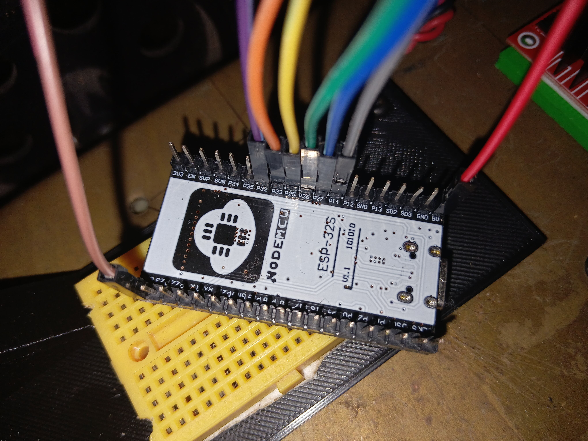

# Talos 🤖

A ROS2-powered robot car built on an ESP32, controlled over WiFi via micro-ROS —
with keyboard/joystick teleop, live phone-camera streaming, OpenCV shape detection,
and real-time RViz visualization.

# ESP32 connection


## Demo

| RViz Visualization | Live Camera Feed | Driving Around |
|:---:|:---:|:---:|
|  |  |  |

## Overview

Talos is an end-to-end robotics stack combining an ESP32-based rover with a full
ROS2 (Jazzy) control, visualization, and vision pipeline.

- **Firmware** — ESP32 running micro-ROS, subscribing to `/cmd_vel` over WiFi,
  driving a 4-wheel L298N motor driver via PWM. Includes automatic WiFi/agent
  reconnect logic and a command-timeout safety stop.
- **Teleop** — WASD keyboard control (and a wired-joystick input option),
  publishing standard `geometry_msgs/Twist` messages to `/cmd_vel`.
- **Vision** — A phone (running an IP Webcam app) streams live video into ROS2
  as a `sensor_msgs/Image` topic. Includes an OpenCV shape detector that
  publishes an annotated feed.
- **Visualization** — A URDF model of the chassis plus a dead-reckoning
  odometry node, viewable live in RViz.

## Repository structure

```
ESP32_mobile_bot/
├── firmware/
│   ├── esp32_car_teleop/          # ESP32 Arduino sketch (micro-ROS + motor control)
│   └── joystick_serial/           # Optional wired joystick board sketch
├── ros2_ws/
│   └── src/
│       ├── phone_camera/          # Phone camera -> ROS2 Image topic
│       └── car_viz/               # URDF, RViz config, fake odometry node
├── scripts/
│   ├── wasd_teleop.py             # Keyboard teleop -> /cmd_vel
│   ├── joystick_serial_teleop.py  # Wired joystick -> /cmd_vel
│   ├── shape_detector_standalone.py
│   └── shape_detector_node.py
├── docs/
│   ├── images/
│   │   └── talos.jpg              # <- put a photo of the robot here
│   └── gifs/
│       ├── rviz_demo.gif          # <- RViz screen recording here
│       ├── camera_demo.gif        # <- live camera feed recording here
│       └── car_moving.gif         # <- robot physically driving here
└── README.md
```

> Create the `docs/images` and `docs/gifs` folders and drop your media in with
> the exact filenames above, and they'll render automatically at the top of
> this README.

## Requirements

- ROS2 Jazzy
- ESP32 board (Arduino core 3.x), `micro_ros_arduino` library
- A native or Dockerized micro-ROS agent matching your `micro_ros_arduino` version
- Python packages: `pyserial`, `opencv-python`
- An IP Webcam app on your phone (for the camera feed)

## Setup

```bash
# ROS2 workspace
cd ros2_ws
colcon build --packages-select phone_camera car_viz
source install/setup.bash

# Python dependencies
pip install pyserial opencv-python --break-system-packages
```

Flash `firmware/esp32_car_teleop/` to your ESP32 via Arduino IDE, and update the
`WIFI_SSID`, `WIFI_PASSWORD`, and `AGENT_IP` (your PC's current IP — check with
`hostname -I`) constants at the top of the sketch first.

## Running everything

Each of these runs in its own terminal.

**1. micro-ROS agent** — bridges the ESP32 to your ROS2 graph
```bash
ros2 run micro_ros_agent micro_ros_agent udp4 --port 8888
```

**2. Power on the ESP32** — no terminal command needed, it connects to WiFi automatically

**3. Keyboard teleop**
```bash
python3 scripts/wasd_teleop.py
```

**4. Phone camera feed** (update the stream URL to your phone's current IP)
```bash
ros2 run phone_camera phone_camera_publisher --ros-args -p stream_url:="http://192.168.1.4:8080/video"
```

**5. View the camera feed**
```bash
ros2 run rqt_image_view rqt_image_view
```

**6. RViz visualization** (robot model + live TF + fake odometry)
```bash
ros2 launch car_viz car_rviz.launch.py
```

**7. Shape detection** (optional — publishes an annotated feed)
```bash
python3 scripts/shape_detector_node.py --ros-args -p stream_url:="http://192.168.1.4:8080/video"
```

## Optional: wired joystick instead of keyboard

Flash `firmware/joystick_serial/joystick_serial.ino` to a separate Arduino board
wired to a joystick module, then:
```bash
python3 scripts/joystick_serial_teleop.py --ros-args -p serial_port:="/dev/ttyACM0"
```

## Known quirks / lessons learned

- ESP32 WiFi power-saving (`WiFi.setSleep`) can silently delay UDP packets for
  seconds at a time — disabled in firmware for reliable teleop.
- `ROS_DOMAIN_ID` and `RMW_IMPLEMENTATION` must match across every terminal
  and the micro-ROS agent, or topics won't be discoverable.
- The micro-ROS agent's discovery port is controlled by `-d/--discovery`
  (default `7400`, i.e. domain 0), not by `ROS_DOMAIN_ID` alone.

## License

MIT (or update to your preference)
